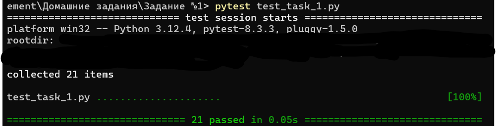

### 1. **Общее описание**
Этот проект состоит из двух основных файлов: `task_1.py` и `test_task_1.py`. 

Файл `task_1.py` реализует терминал с интерфейсом на базе библиотеки Tkinter, позволяющий пользователю взаимодействовать с содержимым ZIP-архива через набор команд. Эти команды включают навигацию по архиву, изменение прав доступа файлов, вывод календаря и поиск файлов в архиве.

Файл `test_task_1.py` содержит набор тестов для проверки функциональности команд, реализованных в `task_1.py`. Тесты запускают сценарии для проверки работы команд, таких как `ls`, `cd`, `chmod`, `cal`, `find` и другие.

### 2. **Описание всех функций и настроек**
#### Файл `task_1.py`:
- **`parse_arguments()`**  
  Читает аргументы командной строки и возвращает их в виде объекта. Аргументы:
  - `user_name` — имя пользователя,
  - `pc_name` — имя компьютера,
  - `zip_path` — путь к ZIP-архиву.

- **`command(cmd=None)`**  
  Выполняет команды, введенные пользователем:
  - `ls` — выводит содержимое текущей директории в архиве,
  - `exit` — завершает программу,
  - `cd <path>` — меняет текущую директорию,
  - `chmod <mode> <file>` — изменяет права доступа к файлу,
  - `cal [month] [year]` — выводит календарь на заданный месяц и год (или текущий месяц, если аргументы не заданы),
  - `find <search_term>` — ищет файлы по ключевому слову.

- **`find(search_term)`**  
  Ищет файлы в архиве, содержащие указанный ключевой термин.

- **`cal(month=None, year=None)`**  
  Выводит календарь на указанный месяц и год. Если аргументы не заданы, выводится календарь на текущий месяц.

- **`chmod(mode, file_path)`**  
  Меняет права доступа к файлу в архиве (симуляция изменения прав, сохраняется в переменной `permissions`).

- **`ls(name_list)`**  
  Выводит содержимое текущей директории архива, включая файлы и папки.

- **`cd(path)`**  
  Меняет текущую директорию в архиве. Поддерживаются команды для перехода в корень и в поддиректории.

- **`updateLabel()`**  
  Обновляет метку, отображающую текущую директорию или возвращает текст, если интерфейс не используется.

- **`write(text="")`**  
  Выводит текст в текстовое поле интерфейса или возвращает текст, если интерфейс не используется.

- **`clear()`**  
  Очищает текстовое поле интерфейса.

#### Файл `test_task_1.py`:
- **Тестовые функции**  
  Набор функций для тестирования каждой функции программы. Например:
  - `test_parse_arguments()` проверяет корректность разбора аргументов,
  - `test_chmod()` и `test_chmod_invalid_mode()` тестируют команду `chmod` с корректными и некорректными параметрами,
  - `test_cal_current_month()` и `test_cal_specific_month()` проверяют вывод календаря,
  - `test_find()` и `test_find_no_results()` тестируют поиск файлов и поведение при отсутствии результатов.

- **`run_tests()`**  
  Запускает все тестовые функции.

### 3. **Описание команд для сборки проекта**

Проект не требует отдельной сборки, так как написан на Python. Команды для запуска скриптов:

1. Для запуска основного скрипта `task_1.py`:
   ```
   py task_1.py <user_name> <pc_name> <path_to_zip_archive>
   ```
   Где:
   - `<user_name>` — имя пользователя,
   - `<pc_name>` — имя компьютера,
   - `<path_to_zip_archive>` — путь к ZIP-архиву.

2. Для запуска скрипта с тестами `test_task_1.py`:
   ```
   pytest test_task_1.py
   ```
   Этот скрипт запускает все тесты, проверяющие функциональность команд.

### 4. **Примеры использования**


### 5. **Результаты прогона тестов**
