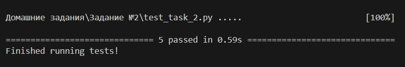

### 1. **Общее описание**

Этот проект представляет собой инструмент для анализа зависимостей JavaScript/Node.js-проектов. Он парсит файл `package.json` из каталогов, находящихся в директории `node_modules`, рекурсивно собирает зависимости всех пакетов и формирует граф зависимостей в формате диаграммы Mermaid. Основная цель — визуализировать зависимости проекта с помощью автоматической генерации кода для Mermaid, который можно использовать для построения диаграмм.

Основные шаги работы программы:
1. Чтение конфигурации из YAML-файла `config.yaml`.
2. Рекурсивное получение зависимостей из файлов `package.json`, расположенных в `node_modules`.
3. Построение диаграммы зависимостей в формате Mermaid.
4. Запись результата в указанный файл.

### 2. **Описание всех функций и настроек**

1. **`parse_package_json(package_path: str, package: str)`**  
   Функция предназначена для парсинга файла `package.json` определенного пакета, чтобы извлечь его зависимости.  
   - **Аргументы**:
     - `package_path`: Путь к директории, в которой содержатся пакеты (`node_modules`).
     - `package`: Название пакета, чей `package.json` нужно парсить.
   - **Возвращает**: Словарь зависимостей (`dependencies`) из файла `package.json` или пустой словарь, если файл не найден.
  
2. **`fetch_deps_from_node_modules(node_modules_path: str, deps: list, package: str)`**  
   Рекурсивно извлекает зависимости из всех пакетов, начиная с указанного пакета, и добавляет их в список.  
   - **Аргументы**:
     - `node_modules_path`: Путь к директории `node_modules`.
     - `deps`: Список для хранения зависимостей, куда добавляются все найденные зависимости.
     - `package`: Название начального пакета, с которого начинается рекурсивный процесс поиска зависимостей.
   - **Возвращает**: Ничего не возвращает, но изменяет список `deps`, добавляя в него найденные зависимости.
  
3. **`build_mermaid(deps)`**  
   Строит Mermaid-диаграмму зависимостей по переданному списку.  
   - **Аргументы**:
     - `deps`: Список кортежей, где каждый кортеж представляет собой связь зависимостей в формате `(пакет, зависимость)`.
   - **Возвращает**: Строку с Mermaid-кодом, описывающую зависимости в формате диаграммы.

4. **`read_config(config_path: str)`**  
   Функция для чтения конфигурационного файла `config.yaml`.  
   - **Аргументы**:
     - `config_path`: Путь к конфигурационному файлу YAML.
   - **Возвращает**: Объект, представляющий данные из YAML-файла в виде Python-словаря.

5. **`main()`**  
   Основная функция, которая:
   - Читает конфигурацию.
   - Рекурсивно извлекает зависимости из директории `node_modules`.
   - Создает Mermaid-диаграмму и записывает ее в файл.
   - Выводит результат в консоль и сохраняет его в файл.

   - **Конфигурационные параметры**:
     - `package_path`: Путь к директории `node_modules`, указанный в конфигурационном файле `config.yaml`.
     - `output_path`: Путь к файлу для записи сгенерированного кода Mermaid.

### 3. **Описание команд для сборки проекта**

1. **Для запуска основного скрипта** `task_2.py`:
   ```
   python task_2.py
   ```
   Это запустит основную программу, которая:
   - Прочитает конфигурационный файл `config.yaml`.
   - Соберет зависимости из папки `node_modules`.
   - Сгенерирует Mermaid-диаграмму и запишет её в указанный конфигурацией файл.

   Также необходимо перед началом работы загрузить какой-либо npm-пакет через npm-менеджер непосредственно из папки задания, дабы в ней создалась папка `node_modules`, в которой будут все зависимости установленного пакета:
   ```
   npm install <имя_пакета>
   ``` 

2. **Для запуска скрипта с тестами** `test_task_2.py`:
   ```
   pytest test_task_2.py 
   ```
   Это запустит все тесты, проверяющие функциональность команд. Тесты покрывают следующие функции:
   - `parse_package_json`
   - `fetch_deps_from_node_modules`
   - `build_mermaid`

### 4. **Примеры использования**


### 5. **Результаты прогона тестов**


