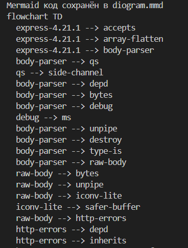

### 1. **Общее описание**

Этот проект представляет собой инструмент для анализа зависимостей JavaScript/Node.js-проектов. Он парсит файл `package.json`, находящийся внутри ZIP-архива, рекурсивно собирает транзитивные зависимости через NPM API и формирует граф зависимостей в формате диаграммы Mermaid. Основная цель — визуализировать зависимости проекта с помощью автоматической генерации кода для Mermaid, который можно использовать для построения диаграмм.

Основные шаги работы программы:
1. Чтение конфигурации из YAML-файла `config.yaml`.
2. Парсинг зависимостей из файла `package.json` внутри ZIP-архива.
3. Рекурсивное получение транзитивных зависимостей через NPM API.
4. Построение диаграммы зависимостей в формате Mermaid.
5. Запись результата в указанный файл.

### 2. **Описание всех функций и настроек**

1. **`parse_package_json_from_zip(zip_path: str)`**  
   Функция предназначена для извлечения зависимостей из файла `package.json`, находящегося внутри ZIP-архива.  
   - **Аргументы**:
     - `zip_path`: Путь к ZIP-архиву с пакетом.
   - **Возвращает**: Кортеж, содержащий:
     - Словарь зависимостей (`dependencies`) из файла `package.json`.
     - Имя пакета, извлечённое из названия ZIP-архива.

2. **`fetch(name: str, version: str)`**  
   Выполняет запрос к NPM API для получения зависимостей указанного пакета.  
   - **Аргументы**:
     - `name`: Название пакета.
     - `version`: Версия пакета.
   - **Возвращает**: Словарь зависимостей пакета из NPM API или пустой словарь, если запрос не был успешным.

3. **`fetch_deps_from_internet(deps: list, package: str, version: str)`**  
   Рекурсивно извлекает транзитивные зависимости пакета через NPM API и добавляет их в список.  
   - **Аргументы**:
     - `deps`: Список для хранения зависимостей, куда добавляются найденные зависимости.
     - `package`: Название пакета, для которого нужно найти транзитивные зависимости.
     - `version`: Версия пакета.
   - **Возвращает**: Ничего не возвращает, но изменяет список `deps`, добавляя в него найденные зависимости.

4. **`build_mermaid(deps: list, root_package: str)`**  
   Строит Mermaid-диаграмму зависимостей по переданному списку.  
   - **Аргументы**:
     - `deps`: Список кортежей, где каждый кортеж представляет собой связь зависимостей в формате `(пакет, зависимость)`.
     - `root_package`: Название корневого пакета.
   - **Возвращает**: Строку с Mermaid-кодом, описывающую зависимости в формате диаграммы.

5. **`read_config(config_path: str)`**  
   Функция для чтения конфигурационного файла `config.yaml`.  
   - **Аргументы**:
     - `config_path`: Путь к конфигурационному файлу YAML.
   - **Возвращает**: Объект, представляющий данные из YAML-файла в виде Python-словаря.

6. **`main()`**  
   Основная функция, которая:
   - Читает конфигурацию.
   - Парсит зависимости из файла `package.json` в ZIP-архиве.
   - Рекурсивно извлекает транзитивные зависимости через NPM API.
   - Создает Mermaid-диаграмму и записывает её в файл.
   - Выводит результат в консоль и сохраняет его в файл.

   - **Конфигурационные параметры**:
     - `package_path`: Путь к ZIP-архиву с пакетом, указанный в конфигурационном файле `config.yaml`.
     - `output_path`: Путь к файлу для записи сгенерированного кода Mermaid.

### 3. **Описание команд для сборки проекта**

1. **Для запуска основного скрипта** `task_2.py`:
   ```
   python task_2.py
   ```
   Это запустит основную программу, которая:
   - Прочитает конфигурационный файл `config.yaml`.
   - Соберет зависимости из файла `package.json` в ZIP-архиве.
   - Сгенерирует Mermaid-диаграмму и запишет её в указанный конфигурацией файл.

2. **Для запуска скрипта с тестами** `test_task_2.py`:
   ```
   pytest test_task_2.py 
   ```
   Это запустит все тесты, проверяющие функциональность команд. Тесты покрывают следующие функции:
   - `parse_package_json_from_zip`
   - `fetch`
   - `fetch_deps_from_internet`
   - `build_mermaid`
   - `read_config`

### 4. **Примеры использования**



### 5. **Результаты прогона тестов**


