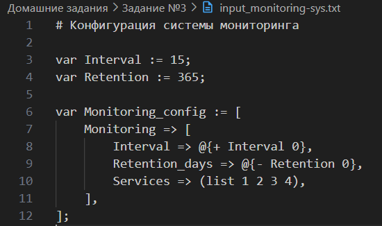

### 1. **Общее описание**

Данная программа представляет собой интерпретатор конфигурационного языка, позволяющий обрабатывать переменные, константные выражения, списки и словари, определённые пользователем в специальном формате. Программа удаляет комментарии, поддерживает арифметические операции, такие как сложение, умножение и остаток от деления, а также подставляет значения переменных в выражения. Основной результат работы программы выводится в формате YAML, где значения переменных и выражений преобразуются в конечные значения для списков и словарей.

Программа ориентирована на работу с конфигурационными файлами, которые содержат простые выражения и данные в виде переменных, списков и словарей. Она также проверяет синтаксические ошибки и сообщает о них, если встречает некорректные выражения или неправильно определённые переменные.

### 2. **Описание всех функций и настроек**

1. **`evaluate_expression(op, var1, var2, variables)`**:
   - Описание: Выполняет арифметические операции между двумя операндами. Поддерживаются операции: сложение, вычитание, умножение, остаток от деления, и нахождение минимального значения.
   - Аргументы:
     - `op`: строка, представляющая оператор (например, '+', '-', '*', 'mod', 'min').
     - `var1` и `var2`: переменные или значения, над которыми производится операция.
     - `variables`: словарь всех объявленных переменных.
   - Возвращает: Результат арифметической операции.
   - Исключения: Генерирует `ConfigSyntaxError`, если операнды не могут быть преобразованы в числа.

2. **`remove_comments(text)`**:
   - Описание: Удаляет комментарии из конфигурационного текста. Поддерживаются однострочные и многострочные комментарии.
   - Аргументы:
     - `text`: строка с исходным текстом конфигурации.
   - Возвращает: Строку без комментариев.

3. **`parse_expression(expr, variables)`**:
   - Описание: Обрабатывает выражения вида `@{операция операнд1 операнд2}`. Проверяет корректность выражения и выполняет вычисления.
   - Аргументы:
     - `expr`: строка с выражением.
     - `variables`: словарь объявленных переменных.
   - Возвращает: Результат выражения.
   - Исключения: Генерирует `ConfigSyntaxError`, если выражение некорректно или содержит синтаксическую ошибку.

4. **`parse_value(value, variables)`**:
   - Описание: Разбирает значение (число, переменная или выражение). Определяет, является ли значение числом, переменной или выражением, и возвращает его итоговое значение.
   - Аргументы:
     - `value`: строка с переменной, числом или выражением.
     - `variables`: словарь объявленных переменных.
   - Возвращает: Значение после разбора и подстановки переменной.
   - Исключения: Генерирует `ConfigSyntaxError` для неизвестных значений.

5. **`parse_dict(text, variables)`**:
   - Описание: Обрабатывает текстовые данные, представляющие словарь. Разбирает ключи и значения и подставляет значения переменных.
   - Аргументы:
     - `text`: строка, представляющая словарь в формате `[ключ1 => значение1, ключ2 => значение2]`.
     - `variables`: словарь объявленных переменных.
   - Возвращает: Словарь Python с подставленными значениями.
   - Исключения: Генерирует `ConfigSyntaxError` в случае синтаксической ошибки.

6. **`parse_list(text, variables)`**:
   - Описание: Разбирает текст, представляющий список, подставляет переменные или вычисляет выражения для каждого элемента списка.
   - Аргументы:
     - `text`: строка, представляющая список в формате `(list элемент1 элемент2 ...)`.
     - `variables`: словарь объявленных переменных.
   - Возвращает: Список Python с подставленными значениями.
   - Исключения: Генерирует `ConfigSyntaxError`, если список содержит ошибки.

7. **`parse_input(input_text)`**:
   - Описание: Основная функция для разбора всего входного текста конфигурации. Удаляет комментарии, разбирает переменные, списки и словари.
   - Аргументы:
     - `input_text`: строка с текстом конфигурации.
   - Возвращает: Словарь с итоговыми данными (списки и словари).
   - Исключения: Генерирует `ConfigSyntaxError`, если встречаются синтаксические ошибки или неизвестные конструкции.

8. **`main()`**:
   - Описание: Основная функция программы, которая запускается при выполнении скрипта. Считывает файл, вызывает разбор данных и выводит результат в формате YAML.
   - Аргументы: Нет.
   - Возвращает: Ничего. Выводит результат в консоль.
   - Исключения: Обрабатывает исключения `ConfigSyntaxError` и ошибки ввода-вывода, выводит сообщения об ошибках.

### 3. **Описание команд для сборки проекта**

Проект не требует сборки, так как написан на Python. Для его выполнения требуются следующие команды:

1. **Для запуска основного скрипта** `task_3.py`:
   ```bash
   python task_3.py <input_file>
   ```
   Это запустит основную программу, которая:
   - Считывает конфигурационный файл, указанный в качестве аргумента.
   - Обрабатывает переменные, списки, словари, выражения и выводит результат в формате YAML.

2. **Для запуска скрипта с тестами** `test_task_3.py`:
   ```bash
   pytest test_task_3.py
   ```
   Это запустит все тесты, проверяющие функциональность программы. Тесты покрывают следующие функции:
   - `evaluate_expression`
   - `remove_comments`
   - `parse_expression`
   - `parse_value`
   - `parse_dict`
   - `parse_list`
   - `parse_input`

   Эти тесты проверяют правильность работы программы с переменными, списками, словарями и арифметическими выражениями, а также корректное удаление комментариев и обработку синтаксических ошибок.

### 4. **Примеры использования**


### 5. **Результаты прогона тестов**


