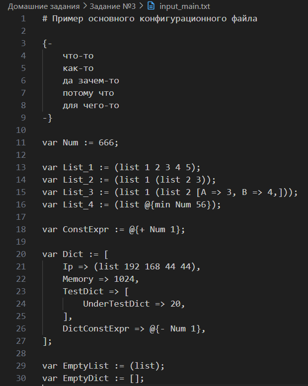
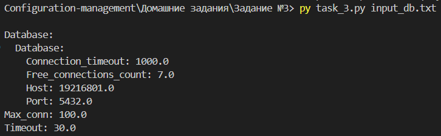

### 1. **Общее описание**

Данная программа представляет собой интерпретатор конфигурационного языка, позволяющий обрабатывать переменные, константные выражения, списки и словари, определённые пользователем в специальном формате. Программа поддерживает арифметические операции, такие как сложение, умножение и остаток от деления, а также минимум из двух чисел. Основной результат работы программы выводится в формате YAML, где значения переменных и выражений преобразуются в конечные значения для списков и словарей.

Программа ориентирована на работу с конфигурационными файлами, содержащими выражения и данные в виде переменных, списков и словарей. Она также проверяет синтаксические ошибки и сообщает о них, если встречает некорректные выражения или неправильно определённые переменные.

### 2. **Описание всех функций и настроек**

1. **`constRes(expr)`**:
   - Описание: Обрабатывает выражения для вычислений над переменными, заданными константно. Поддерживает операции: сложение, вычитание, умножение, остаток от деления и нахождение минимального значения.
   - Аргументы:
     - `expr`: кортеж, содержащий оператор, переменную и операнд для операции.
   - Возвращает: Обновленное значение переменной.
   - Исключения: Генерирует `ParserError`, если операнды не могут быть корректно обработаны.

2. **`mk_item(pairs)`**:
   - Описание: Обрабатывает пары ключ-значение в конфигурациях, представляющих словари, и фильтрует некорректные элементы.
   - Аргументы:
     - `pairs`: список кортежей, представляющих ключ-значение.
   - Возвращает: Список валидных пар (ключ, значение).
   - Исключения: Генерирует `ParserError` при ошибке в синтаксисе словаря.

3. **`assign_const(n_v)`**:
   - Описание: Присваивает значение переменной и сохраняет в глобальном словаре `variables`.
   - Аргументы:
     - `n_v`: кортеж с именем переменной и значением.
   - Возвращает: Кортеж (имя, значение) для добавления в стек.
   - Исключения: Не генерирует.

4. **`parse_file(filepath)`**:
   - Описание: Считывает входной текст из файла и запускает основную функцию разбора.
   - Аргументы:
     - `filepath`: строка, содержащая путь к файлу конфигурации.
   - Возвращает: Итоговые данные (списки и словари) в формате Python-словаря.
   - Исключения: Генерирует `ParserError` при синтаксических ошибках.

5. **`parse_config(src)`**:
   - Описание: Функция для разбора конфигурационного текста напрямую (в основном используется для тестирования). Содержимое преобразуется в формат YAML.
   - Аргументы:
     - `src`: строка с текстом конфигурации.
   - Возвращает: YAML-формат строки.
   - Исключения: Генерирует `ParserError` при синтаксических ошибках.

### 3. **Описание команд для сборки и запуска проекта**

Проект не требует сборки, так как написан на Python. Для его выполнения требуются следующие команды:

1. **Для запуска основного скрипта** `task_3.py`:
   ```bash
   py task_3.py <input_file>
   ```
   Это запустит основную программу, которая:
   - Считывает конфигурационный файл, указанный в качестве аргумента.
   - Обрабатывает переменные, списки, словари, константные выражения и выводит результат в формате YAML.

2. **Для запуска тестов** `test_task_3.py`:
   ```bash
   pytest test_task_3.py
   ```
   Это запустит все тесты, проверяющие функциональность программы, включая:
   - `constRes`
   - `assign_const`
   - `mk_item`
   - `parse_file`
   - `parse_config`

   Эти тесты проверяют правильность работы программы с переменными, списками, словарями и арифметическими выражениями, а также корректную обработку синтаксических ошибок.

### 4. **Примеры использования**



<br>





### 5. **Результаты прогона тестов**

