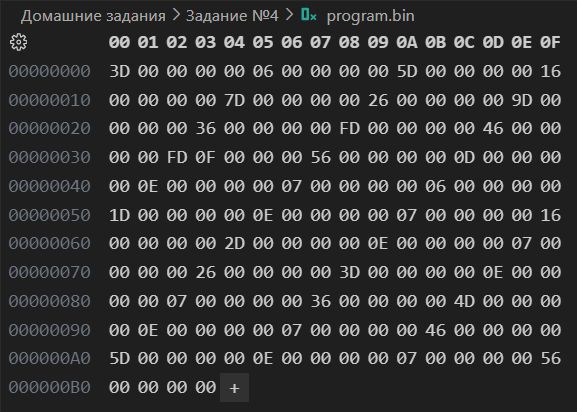
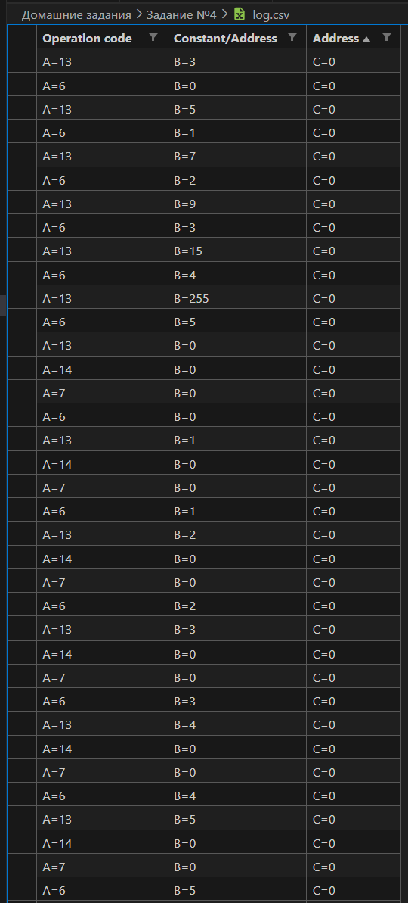
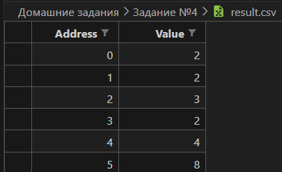
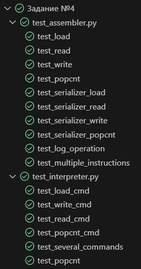
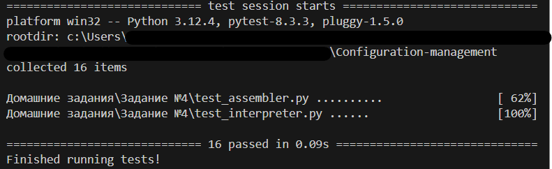

### 1. **Общее описание**

Данная программа включает два основных модуля: **ассемблер** и **интерпретатор**, которые работают с простым виртуальным машинным языком. Ассемблер преобразует текстовые инструкции в бинарный код, а интерпретатор выполняет команды из бинарного файла, модифицируя память виртуальной машины и записывая результат в выходной CSV-файл.

Ассемблер принимает на вход текстовый файл с командами, преобразует их в машинный код, записывает результат в бинарный файл и создаёт лог в формате CSV, который описывает преобразованные инструкции. 

Интерпретатор выполняет инструкции из бинарного файла, поддерживая команды загрузки констант, чтения и записи данных, а также операцию подсчёта единичных битов (popcnt). По завершении работы результат выполнения сохраняется в формате CSV.

#### Структура проекта

- **`assembler.py`**: Модуль ассемблера.
- **`interpreter.py`**: Модуль интерпретатора.
- **`test_assembler.py`**: Тесты для ассемблера.
- **`test_interpreter.py`**: Тесты для интерпретатора.
- **`program.txt`**: Пример входного файла с инструкциями.
- **`program.bin`**: Пример выходного бинарного файла. 
- **`result.csv`**: Пример выходного CSV-файла с результатами.
- **`log.csv`**: Пример выходного CSV-файла с логом операций ассемблера.

### 2. **Описание всех функций и настроек**

#### Ассемблер

1. **`assembler(instructions, log_path=None)`**:
   - Описание: Преобразует текстовые инструкции в бинарный код и сохраняет лог инструкций.
   - Аргументы:
     - `instructions`: список текстовых инструкций.
     - `log_path`: путь к файлу для записи лога инструкций (необязательный аргумент).
   - Возвращает: список байтов в формате машинного кода.
   - Исключения: не генерирует.

2. **`serializer(cmd, fields, size)`**:
   - Описание: Преобразует команду и её параметры в бинарный код.
   - Аргументы:
     - `cmd`: код операции (целое число).
     - `fields`: параметры команды в формате (значение, сдвиг).
     - `size`: количество байт в результате.
   - Возвращает: объект типа `bytes`, представляющий бинарный код команды.
   - Исключения: не генерирует.

3. **`log_operation(log_path, operation_code, *args)`**:
   - Описание: Записывает инструкцию в лог-файл в формате CSV.
   - Аргументы:
     - `log_path`: путь к файлу лога.
     - `operation_code`: код операции.
     - `*args`: параметры команды.
   - Возвращает: ничего.
   - Исключения: не генерирует.

4. **`assemble(instructions_path, log_path=None)`**:
   - Описание: Считывает текстовый файл с инструкциями и преобразует их в бинарный код.
   - Аргументы:
     - `instructions_path`: путь к текстовому файлу с инструкциями.
     - `log_path`: путь к файлу лога (необязательный аргумент).
   - Возвращает: список байтов в формате машинного кода.
   - Исключения: вызывает исключения ввода-вывода при ошибках чтения файла.

5. **`save_to_bin(assembled_instructions, binary_path)`**:
   - Описание: Сохраняет машинный код в бинарный файл.
   - Аргументы:
     - `assembled_instructions`: список байтов.
     - `binary_path`: путь к выходному бинарному файлу.
   - Возвращает: ничего.
   - Исключения: вызывает исключения ввода-вывода при ошибках записи файла.

#### Интерпретатор

1. **`interpreter(binary_path, result_path, memory_range)`**:
   - Описание: Исполняет команды из бинарного файла, модифицируя память виртуальной машины и записывая результат в CSV.
   - Аргументы:
     - `binary_path`: путь к входному бинарному файлу.
     - `result_path`: путь к выходному CSV-файлу.
     - `memory_range`: диапазон ячеек памяти для сохранения результата.
   - Возвращает: ничего.
   - Исключения: вызывает исключения ввода-вывода при ошибках чтения/записи файлов.

2. **`popcnt(value)`**:
   - Описание: Считает количество установленных битов (единиц) в числе.
   - Аргументы:
     - `value`: целое число для анализа.
   - Возвращает: количество единиц в двоичном представлении числа.
   - Исключения: не генерирует.

### 3. **Описание команд для сборки и запуска проекта**

#### Сборка бинарного файла из инструкций

Для создания бинарного файла из текстового файла с инструкциями используйте:
```bash
python assembler.py <instructions.txt> <output.bin> <log.csv>
```
Пример:
```bash
python assembler.py program.txt program.bin log.csv
```

Результат:
1. **`program.bin`** — бинарный файл с машинным кодом.
2. **`log.csv`** — лог, описывающий инструкции и их параметры.

#### Запуск интерпретатора

Для выполнения бинарного файла:
```bash
python interpreter.py <binary_path> <result_path> <first_index> <last_index>
```
Пример:
```bash
python interpreter.py program.bin result.csv 0 5
```

Результат:
1. **`result.csv`** — файл с диапазоном памяти, содержащим результаты выполнения программы.

#### Запуск тестов

Для проверки работы ассемблера и интерпретатора:
```bash
pytest test_assembler.py
pytest test_interpreter.py
```

### 4. **Примеры использования**
Входной файл:
```
load 3 0
write 0 0
load 5 0 
write 1 0 
load 7 0
write 2 0 
load 9 0 
write 3 0 
load 15 0
write 4 0
load 255 0
write 5 0
load 0 0
read 0 0
popcnt 0 0
write 0 0
load 1 0
read 0 0
popcnt 0 0
write 1 0
load 2 0
read 0 0
popcnt 0 0
write 2 0
load 3 0
read 0 0
popcnt 0 0
write 3 0
load 4 0
read 0 0
popcnt 0 0
write 4 0
load 5 0
read 0 0
popcnt 0 0
write 5 0
```


<br>



### 5. **Результаты прогона тестов**


